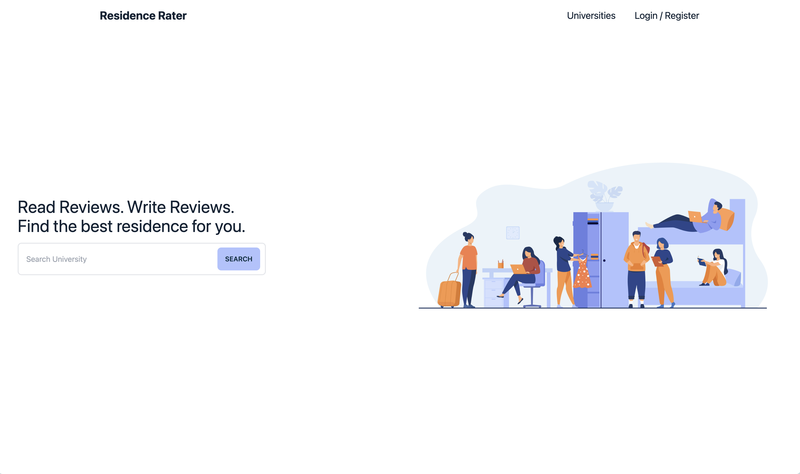
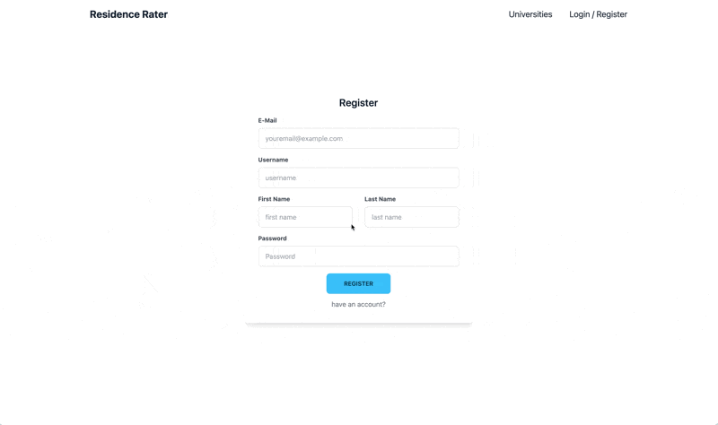
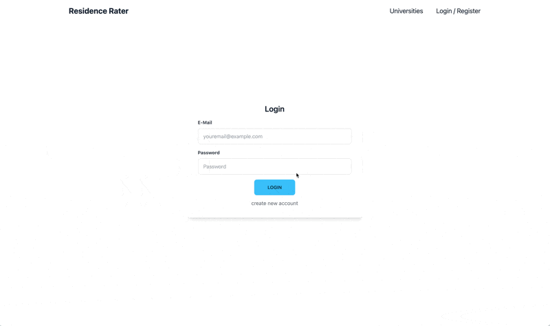

# Ontario University Residence Rater

## About The Project
Ontario Univesity Residence Rater is a web app allowing undergraduate students to provide valuable insights and ratings about their on-campus residences. The goal for this project is to foster a community-driven platform that aids future university students for a deeper understanding of their prospective living arrangements.


## Demo
#### Home Page Preview


#### Authentication Preview



#### Pages Preview


#### Rating Preview


## Installation
Clone the project


#### Frontend
```bash
  cd project-root-directory
  cd frontend
  npm install
  npm run dev
```
#### Backend
```bash
cd project-root-directory
cd backend
pip3 install -r requirements.txt
```
Activate virtual environment
```bash
# Mac
source venv/bin/activate 
or
# Windows
venv\Scripts\activate 
```

#### Database
Create Firebase database and download a serviceAccountKey.json
<br>
Add serviceAccountKey.json into the credentials folder folder
```bash
cd project-root-directory
mkdir credentials
```
to use template for database
```bash
cd project-root-folder
cd backend
#activate virtual environment if not already
python3 load_res.py
```

#### Google Maps Api
Go into serviceAccountKey.json and add 
```bash
{
    ...
    "api_key: "Your_Api_Key"
}
```

## Tech Stack
#### Frontend


#### Backend


#### Database

#### External APIs:


## Acknowledgements

- All university logos are from wikipedia images
- All residence images sourced from each respective universities
- Landing page image by pch.vector ->~<a href="https://www.freepik.com/free-vector/college-student-dorm-interior-young-travelers-stopping-hostel-vector-illustration-alternative-accommodation-backpackers-house-trip-concept_11671356.htm">~Freepik~</a>
- Tech Stack Banners from <a href = "https://github.com/Ileriayo/markdown-badges">Ileriayo</a>

